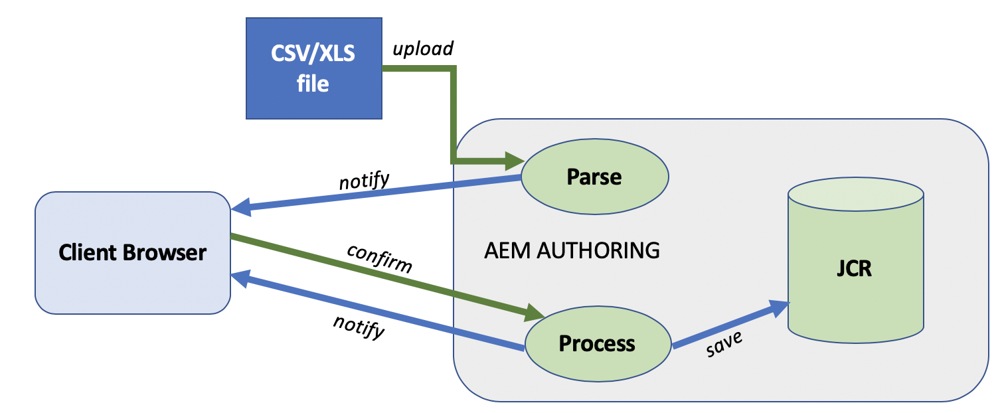

# Nuevo importador de proyectos desde archivo {#new-project-importer-from-file}

En esta sección se describe una funcionalidad para importar de forma masiva un conjunto de ubicaciones de una hoja de cálculo CSV/XLS a su proyecto de AEM Screens.

## Introducción {#introduction}

Cuando configure un proyecto de AEM Screens por primera vez en su organización, cree también todas las ubicaciones. Si el proyecto incluye muchas ubicaciones, se produce una tarea tediosa que implica mucho seleccionar y esperar en la interfaz de usuario.

El objetivo de esta función es reducir el tiempo necesario para configurar el proyecto y resolver así los problemas presupuestarios.

Al permitir que el autor proporcione una hoja de cálculo como archivo de entrada y permitir que el sistema cree automáticamente el árbol de ubicaciones en el back-end, esta función:

* *obtiene un rendimiento mucho mejor que seleccionando manualmente a través de la interfaz de usuario*
* AEM *permite al cliente exportar las ubicaciones que tiene desde su propio sistema e importarlas fácilmente directamente en el sitio de destino*

Este proceso ahorra tiempo y dinero durante la configuración inicial del proyecto o al ampliar el AEM Screens existente a nuevas ubicaciones.

## Información general de la arquitectura {#architectural-overview}

En el diagrama siguiente se muestra la descripción general de la arquitectura de la característica Importador de proyectos:

### Modelo de datos {#data-model}

A continuación se describe el modelo de datos del importador de proyectos:

>[!NOTE]
>
>La versión actual solo admite la importación de ubicaciones.

| **Propiedad** | **Descripción** |
|---|---|
| ***`path {string*}`*** | Ruta de recurso de la ubicación |
| ***`[./jcr:title] {string*}`*** | Nombre de la plantilla que se va a usar (es decir, la ubicación de *screens/core/templates/location*) |
| ***`template {string}`*** | Título opcional que se usará para la página |
| ***`[./jcr:description] {string}`*** | Descripción opcional que se utilizará para la página |

Por lo tanto, el archivo de hoja de cálculo (CSV/XLS) requiere las siguientes columnas:

* **ruta de acceso {string}** - La ruta de acceso de la ubicación que se va a importar, donde la raíz de la ruta de acceso es la carpeta de ubicación del proyecto (es decir, *`/foo`* se importa a *`/content/screens/<project>/locations/foo`*)
* **plantilla {string}**: la plantilla que se usará para la nueva ubicación, por ahora el único valor permitido es &quot;ubicación&quot;, pero este valor se extenderá a todas las plantillas de Screens en el futuro (`display`, `sequencechannel`, etc.)
* **[./*] {string}**: cualquier propiedad opcional que se va a establecer en la ubicación (es decir, `./jcr:title`, `./jcr:description`, `./foo, ./bar`). La versión actual no permite ningún filtrado.

>[!NOTE]
>
>Se ignora cualquier columna que no coincida con las condiciones anteriores. Por ejemplo, si tiene cualquier otra columna definida en el archivo de hoja (CSV/XLS) que no sea **ruta**, **plantilla**, **título** y **descripción** en el archivo, esos campos se omiten. Y **Importador de proyectos** no valida esos campos adicionales para importar el proyecto a su proyecto de AEM Screens.

## Usar el importador de proyectos {#using-project-importer}

En la siguiente sección se describe cómo se utiliza el importador de proyectos en un proyecto de AEM Screens.

>[!CAUTION]
>
>Restricciones:
>
>* La versión actual no admite archivos que no sean extensiones CSV/XLS/XLSX.
>* No existe ningún filtrado de las propiedades para los archivos importados y nada que comience por &quot;./&quot; se importa.
>

### Requisitos previos {#prerequisites}

* Cree un proyecto titulado **DemoProjectImport**

* Utilice un archivo CSV o de Excel de ejemplo que debe importar.

Para fines de demostración, puede descargar un archivo de Excel desde la sección siguiente.

[Obtener archivo](assets/minimal-file.xls)

### Importación del archivo con el mínimo de campos obligatorios {#importing-the-file-with-minimum-required-fields}

Siga los pasos a continuación para importar un archivo a una carpeta de ubicación con los campos mínimos requeridos:

>[!NOTE]
>
>El siguiente ejemplo muestra el mínimo de cuatro campos necesarios para importar el proyecto:

1. Vaya al proyecto de AEM Screens (**DemoProjectImport**).

   

1. Haga clic en el proyecto **&#x200B; DemoProjectImporter &#x200B;**>**&#x200B; Crear &#x200B;**>**&#x200B; ubicaciones de importación** desde la barra lateral.

   

1. Se muestra el asistente **Importar**. Haga clic en el archivo del proyecto con ubicaciones o haga clic en el archivo (***minimal-file.xls***) que descargó de la sección *Requisitos previos*.

   Una vez seleccionado el archivo, haga clic en **Siguiente**.

   

1. Compruebe el contenido del archivo (ubicaciones) en el Asistente para importar y haga clic en **Importar**.

   

1. Como resultado, ahora puede ver todas las ubicaciones importadas al proyecto.

   
