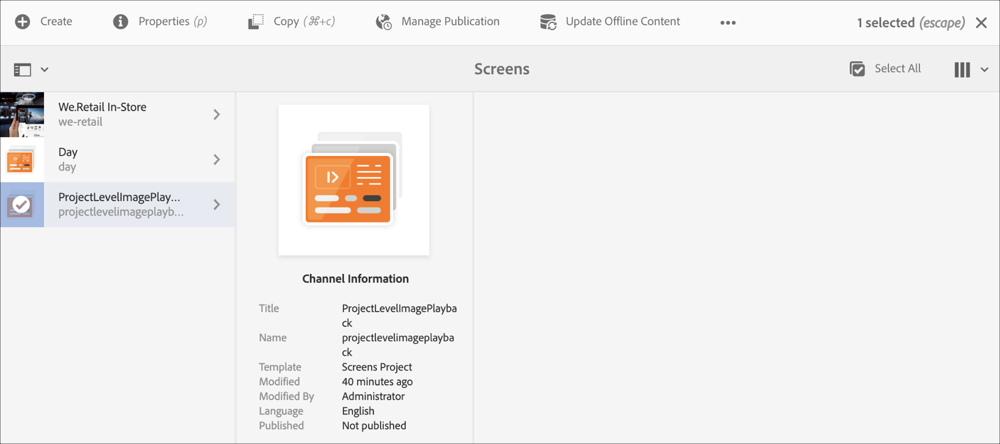

# Duración de reproducción de imágenes en el nivel de proyecto {#project-level-image-playback}

## Información general {#overview}

Esta función le permite definir la duración de la reproducción de la imagen en el nivel de proyecto. De forma predeterminada, todas las imágenes heredan esta duración de reproducción. Si no se define ninguna duración en el nivel de proyecto, continuará la reproducción predeterminada de 8 segundos.

### Requisitos previos {#prerequisites}

Antes de utilizar esta función, asegúrese de configurar un proyecto como requisito previo para empezar a implementar esta funcionalidad. Por ejemplo,

1. Creación de un proyecto de AEM Screens (en este ejemplo, **ProjectLevelPlayback**)

1. Creación de un canal de secuencia como **PlayBackChannel** en la carpeta **Canales**

1. Agregar contenido a **PlayBackChannel**

   

   Por ejemplo, la siguiente imagen muestra las imágenes agregadas al editor **PlayBackChannel** :

   

## Edición de la asignación de duración de reproducción de imágenes de nivel de proyecto {#editing-project-level-image-playback-duration-assignment}

En la sección siguiente se explica cómo editar la duración de la reproducción de contenido en un proyecto de AEM Screens.

### Actualización de la duración de reproducción de imágenes a nivel de proyecto {#updating-the-playback-duration-for-images-in-a-project}

>[!NOTE]
>Si desea actualizar la duración de reproducción de una imagen o un canal, consulte Duración [de reproducción de imagen a nivel de](channel-level-image-playback.md)canal.

Siga los pasos a continuación para aprender a actualizar la duración de la reproducción de imágenes en el nivel de proyecto:

1. Navigate to your project **ProjectLevelPlayback** and click **Properties** from the action bar.
   

1. Seleccione todas las imágenes del canal y haga clic en el icono de la llave inglesa en la parte superior izquierda (como se muestra en la figura siguiente) para abrir el cuadro de diálogo Configurar nivel de canal.

   

1. **Se abre el cuadro de diálogo Página** .

   >[!NOTE]
   >
   >De forma predeterminada, las imágenes de un canal se definen en una duración de reproducción de 8 segundos y los vídeos se reproducen con la duración predeterminada.

   

   Edite la **duración** de 8000 (ms) a 3000 (ms), es decir, 3 segundos. Haga clic en la marca de verificación en la parte superior derecha del cuadro de diálogo **Página** para guardar los cambios.

   

### Visualización del resultado {#viewing-the-result}

Una vez que haya actualizado la duración de la reproducción del canal (en este ejemplo, las tres imágenes), notará que las imágenes se reproducirán durante 3 segundos en lugar de 8 segundos (valor predeterminado).

