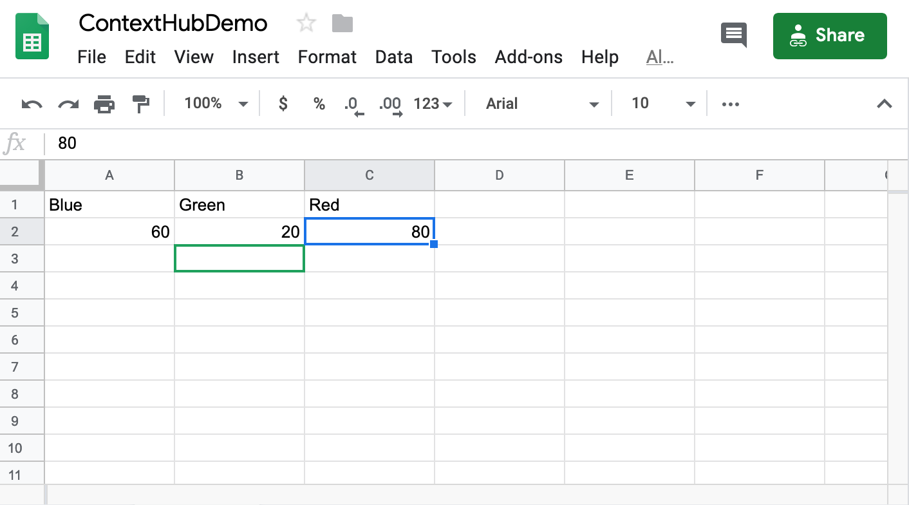
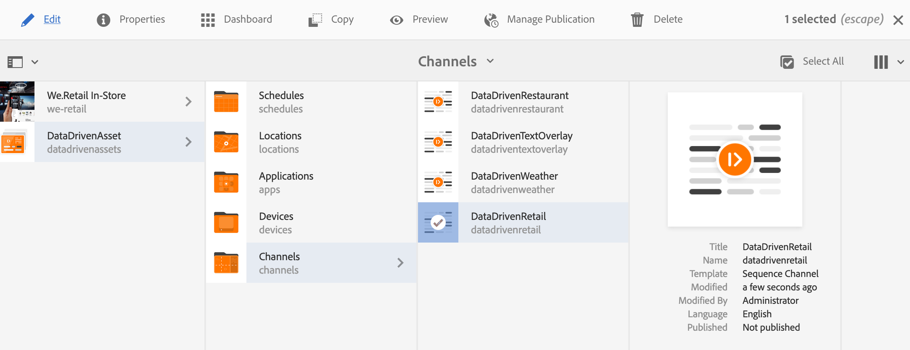

# Activación de destino de inventario comercial {#retail-inventory-targeted-activation}

El siguiente caso de uso muestra tres imágenes diferentes basadas en los valores de la hoja de Google.

## Descripción {#description}

Este caso de uso muestra el inventario de existencias para tres sudaderas de color diferentes. Dependiendo del número de suéters disponibles en existencias que se registren en Google Sheets, la imagen (camisa roja, verde o azul) con el número más alto se muestra en la pantalla.

Para este caso de uso, el suéter rojo, verde o azul se mostrará en la pantalla en función del valor más alto del número de suéters disponible.

## Condiciones previas {#preconditions}

Antes de empezar a implementar la activación de la segmentación de inventario minorista, debe aprender a configurar ***Data Store***, ***Segmentación de audiencia*** y ***Habilitar segmentación para canales*** en un proyecto de AEM Screens.

Consulte [Configuración de ContextHub en AEM Screens](configuring-context-hub.md) para obtener información detallada.

## Flujo básico {#basic-flow}

Siga los pasos a continuación para implementar el caso de uso Activación de inventario comercial:

1. **Rellenar las hojas de Google**

   1. Vaya a la hoja de Google de ContextHubDemo.
   1. Añada tres columnas (Rojo, Verde y Azul) con los valores correspondientes para tres camisas sudaderas diferentes.

   

1. **Configuración de las audiencias según los requisitos**

   1. Vaya a los segmentos de la audiencia (consulte ***Paso 2: Configuración de la segmentación de audiencia*** en **[Configuración de ContextHub en la página AEM Screens](configuring-context-hub.md)** para obtener más información).

   1. Agregue tres nuevos segmentos **For_Red**, **For_Green** y **For_Blue**.

   1. Seleccione **For_Red** y haga clic en **Editar** en la barra de acciones.

   1. Arrastre y suelte la **Comparación : Propiedad - Propiedad** al editor y haga clic en el icono de configuración para editar las propiedades.
   1. Seleccione **googlesheets/value/1/2** de la lista desplegable en **First Property name**

   1. Seleccione el **Operator** como **bueno-than** en el menú desplegable

   1. Seleccione **Tipo de datos** como **número**

   1. Seleccione **googlesheets/value/1/1** en la lista desplegable de **Second Property name**.

   1. Arrastre y suelte **otra comparación : Propiedad - Propiedad** al editor y haga clic en el icono de configuración para editar las propiedades.
   1. Seleccione **googlesheets/value/1/2** en la lista desplegable de **First Property name**.

   1. Seleccione el **Operator** como **bueno-than** en el menú desplegable

   1. Seleccione **Tipo de datos** como **número**

   1. Seleccione **googlesheets/value/1/0** de la lista desplegable en **Second Property name**

   

   Del mismo modo, edite y agregue reglas de propiedad de comparación al segmento **For_Blue** como se muestra en la figura siguiente:

   

   Del mismo modo, edite y agregue reglas de propiedad de comparación al segmento** For_Green **como se muestra en la figura siguiente:

   

   >[!NOTE]
   >
   >Verá que para los segmentos **For_Green** y **For_Green**, los datos no se pueden resolver en el editor, ya que solo la primera comparación es válida a partir de ahora según los valores de la hoja de Google.

1. Navegue y seleccione el canal **DataDrivenRetail** (un canal secuencial) y haga clic en **Editar** en la barra de acciones.

   

   >[!CAUTION]
   >
   >Debería haber configurado su **ContextHub** **Configuraciones** utilizando la pestaña **Propiedades** —> **Personalización**.

   

   >[!NOTE]
   Debe seleccionar la **Marca** y el **Área** para que las actividades aparezcan correctamente en la lista al iniciar el proceso de Segmentación.

1. **Adición de una imagen predeterminada**

   1. Añada una imagen predeterminada al canal y haga clic en **Segmentación**.
   1. Seleccione **Marca** y **Actividad** en el menú desplegable y haga clic en **Iniciar orientación**.

   1. Haga clic en **Iniciar Targeting**.

   

   >[!NOTE]
   Antes de comenzar a establecer el objetivo, debe agregar los segmentos (**For_Green**, **For_Red** y **For_Blue**) haciendo clic en **+ Añadir Segmentación de experiencias** desde el carril lateral, como se muestra en la figura siguiente.

   

1. Agregue las imágenes a los tres escenarios diferentes como se muestra a continuación.

   

1. **Comprobación de la vista previa**

   1. Haga clic en **Preview.** Además, abra la hoja de Google y actualice su valor.
   1. Cambie el valor de las tres columnas diferentes y verá las actualizaciones de la imagen de visualización según el valor más alto del inventario.
   
