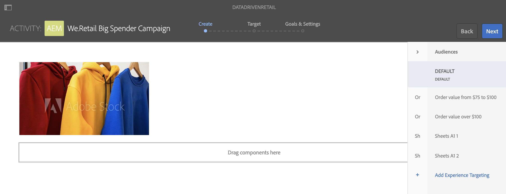
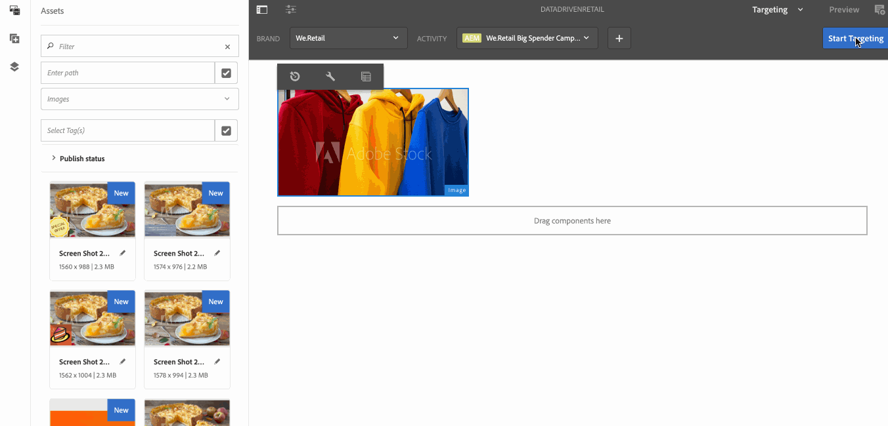

# Activación segmentada de inventario comercial {#retail-inventory-targeted-activation}

>[!IMPORTANT]
>Este contenido es válido para AEM on-premise/AMS (AEM 6.5LTS y AEM 6.5). Para el contenido de AEM as a Cloud Service Screens, consulte la [guía de AEM as a Cloud Service](https://experienceleague.adobe.com/en/docs/experience-manager-cloud-service/content/screens-as-cloud-service/overview/introduction).

En el siguiente caso de uso se muestran tres imágenes diferentes basadas en los valores de la hoja de cálculo de Google.

## Descripción {#description}

Este caso de uso muestra el inventario minorista de existencias de tres sudaderas de colores diferentes. En función del número de sudaderas disponibles en stock que se registren en las Hojas de cálculo de Google, se mostrará la imagen (sudadera roja, verde o azul) con el número más alto.

El suéter rojo, verde o azul se muestra en función del valor más alto del número de suéters disponibles.

## Condiciones previas {#preconditions}

Antes de comenzar a implementar la activación de segmentación de inventario comercial, aprende a configurar ***Almacén de datos***, ***Segmentación de audiencia*** y ***Habilitar segmentación para canales*** en un proyecto de AEM Screens.

Consulte [Configuración de ContextHub en AEM Screens](configuring-context-hub.md) para obtener información detallada.

## Flujo básico {#basic-flow}

Siga los pasos a continuación para implementar el caso de uso Activación de inventario comercial:

1. **Rellenando las hojas de Google**

   1. Navegue hasta la hoja de Google de ContextHubDemo.
   1. Agregue tres columnas (rojo, verde y azul) con los valores correspondientes para tres sudaderas diferentes.

   

1. **Configuración de las audiencias según los requisitos**

   1. Vaya a los segmentos de su audiencia (consulte ***Paso 2: Configuración de la segmentación de audiencia*** en la página **[Configuración de ContextHub en AEM Screens](configuring-context-hub.md)** para obtener más información).

   1. Agregue tres nuevos segmentos **For_Red**, **For_Green** y **For_Blue**.

   1. Haga clic en **For_Red** y luego en **Editar** en la barra de acciones.

   1. Arrastre y suelte la **Comparación : propiedad - propiedad** en el editor.
   1. Haga clic en el icono **Configuración**.
   1. Haga clic en **googlesheets/value/1/2** en la lista desplegable de **Nombre de la primera propiedad**.
   1. Haga clic en **Operador** y seleccione **mayor que** en el menú desplegable.
   1. Haga clic en **Tipo de datos** y como **número**.
   1. Haga clic en **googlesheets/value/1/1** en la lista desplegable de **Second Property name**.
   1. Arrastre y suelte **otra comparación : propiedad - propiedad** en el editor y haga clic en el icono **Configuración**.
   1. Haga clic en **googlesheets/value/1/2** en la lista desplegable de **Nombre de la primera propiedad**.
   1. Haga clic en **Operador** y seleccione **mayor que** en el menú desplegable.
   1. Haga clic en **Tipo de datos** y como **número**.
   1. Haga clic en **googlesheets/value/1/0** en la lista desplegable de **Second Property name**.

   

   Del mismo modo, edite y agregue reglas de propiedades de comparación al segmento **For_Blue**, tal como se muestra en la figura siguiente:

   

   Del mismo modo, edite y agregue reglas de propiedades de comparación al segmento **For_Green**, tal como se muestra en la figura siguiente:

   

   >[!NOTE]
   >
   >Tenga en cuenta que para los segmentos **For_Green** y **For_Green**, los datos no se pueden resolver en el editor ya que solo la primera comparación es válida a partir de ahora según los valores de la hoja de cálculo de Google.

1. Navegue y haga clic en su canal **DataDrivenRetail** (un canal de secuencia).
1. Haga clic en **Editar** en la barra de acciones.

   

   >[!CAUTION]
   >
   >Ya debería haber configurado **ContextHub** **Configuraciones** con la pestaña **Propiedades** > **Personalization** del canal.

   

   >[!NOTE]
   >
   >Haga clic en **Marca** y en **Área** para que las actividades se incluyan en la lista correcta al iniciar el proceso de segmentación.

1. **Agregando una imagen predeterminada**

   1. Agregue una imagen predeterminada a su canal y haga clic en **Segmentación**.
   1. Haga clic en **Marca** y en la **Actividad** del menú desplegable y luego haga clic en **Iniciar segmentación**.
   1. Haga clic en **Iniciar segmentación**.

   

   >[!NOTE]
   >
   >Antes de empezar a segmentar, agrega los segmentos (**For_Green**, **For_Red** y **For_Blue**) seleccionando **+ Agregar segmentación de experiencia** del carril lateral como se muestra en la figura siguiente.

   

1. Agregue las imágenes a los tres escenarios diferentes como se muestra a continuación.

   

1. **Comprobando la vista previa**

   1. Haga clic en **Vista previa.** Además, abra la hoja de Google y actualice su valor.
   1. Cambie el valor de las tres columnas diferentes. Observe que la imagen para mostrar se actualiza según el valor más alto del inventario.

   
