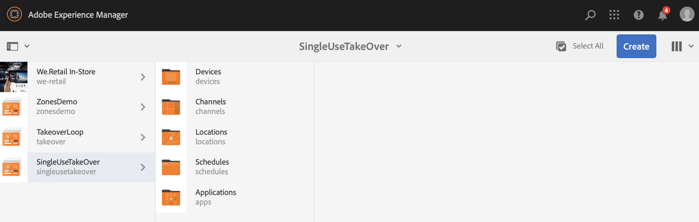

# Canal de adquisición de un solo uso {#single-use-takeover-channel}

La siguiente página muestra un caso de uso que hace hincapié en la configuración de un proyecto sobre cómo crear un canal de toma de posesión única que se reproduce una vez durante un tiempo específico.

## Descripción del caso de uso {#use-case-description}

Este caso de uso explica cómo crear un canal que *tome el control de* del canal de reproducción normal para una pantalla o un grupo de pantallas. La adquisición solo se produce una vez y por un tiempo específico.

Por ejemplo, hay un canal Single TakeOver que se reproduce los viernes de 9:00 a.m. a 10:00 a.m. Durante este tiempo, no se debe reproducir ningún otro canal. Antes y después de este tiempo, el canal Adquisición de un solo uso no se reproduce. El siguiente ejemplo muestra la creación de un único canal de adquisición que permite que el contenido se reproduzca durante 2 minutos antes de las 12:00 a.m. del 31 de diciembre hasta las 12:01 a.m.

### Condiciones previas {#preconditions}

Antes de comenzar este caso de uso, asegúrese de comprender cómo:

* **[Crear y administrar canales](managing-channels.md)**
* **[Crear y administrar ubicaciones](managing-locations.md)**
* **[Crear y administrar horarios](managing-schedules.md)**
* **[Registro de dispositivo](device-registration.md)**

### Actores principales {#primary-actors}

Autores de contenido

## Configuración del proyecto {#setting-up-the-project}

Siga los pasos a continuación para configurar un proyecto:

**Configurando los canales y la pantalla**

1. Cree un proyecto de AEM Screens con el título **SingleUseTakeOver**, como se muestra a continuación.

   

1. Cree un **MainAdChannel** en la carpeta **Channels**.

   

1. Haga clic en **MainAdChannel** y luego en **Editar** en la barra de acciones. Arrastre y suelte algunos recursos (imágenes, vídeos, secuencias incrustadas) en su canal.

   

   >[!NOTE]
   >El **MainAdChannel** de este ejemplo muestra un canal de secuencia que reproduce contenido continuamente.

   

1. Cree un canal **TakeOver** que se haga cargo del contenido de **MainAdChannel** y que se reproduzca únicamente para un día y una hora determinados.

1. Haga clic en **TakeOver** y luego en **Editar** en la barra de acciones. Arrastre y suelte algunos recursos en su canal. El siguiente ejemplo muestra una imagen de zona única agregada a este canal.

   

1. Configure una ubicación y una visualización para sus canales. Por ejemplo, la siguiente ubicación **Lobby** y la visualización **MainLobbyDisplay** están configuradas para este proyecto.

   

**Asignación de canales a una pantalla**

1. Haga clic en la pantalla **MainLobbyDisplay** de la carpeta **Ubicaciones**. Haga clic en **Asignar canal** en la barra de acciones.

   

   >[!NOTE]
   >Para obtener información sobre cómo asignar un canal a una pantalla, consulte **[Asignación de canales](channel-assignment.md)**.

1. Rellene los campos (**Ruta de canal**, **Prioridad** y **Eventos admitidos**) del cuadro de diálogo **Asignación de canal** y haga clic en **Guardar**. Ahora ha asignado **MainAdChannel** a la pantalla.

   

1. Haga clic en la pantalla **TakeOver** de la carpeta **Ubicaciones**. Haga clic en **Asignar canal** en la barra de acciones para que pueda asignar el canal de adquisición de un solo uso.

1. Asigne el canal **TakeOver** a la pantalla a una hora programada, rellene los campos siguientes del cuadro de diálogo **Asignación de canal** y haga clic en **Guardar**:

   * **Ruta de canal**: haga clic en la ruta al canal TakeOver
   * **Prioridad**: establezca una prioridad de este canal mayor que **MainAdChannel**. Por ejemplo, la prioridad establecida en este ejemplo es 8.

     >[!NOTE]
     >La prioridad puede ser cualquier valor superior al valor de prioridad del canal de reproducción normal.
   * **Eventos admitidos**: haga clic en **Pantalla inactiva** y **Temporizador**.
   * **Programación**: escriba el texto de la programación que desea que este canal ejecute en la pantalla. Por ejemplo, el texto aquí permite que el contenido se reproduzca 2 minutos antes de las 12:00 a.m. del 31 de diciembre hasta las 12:01 a.m.
El texto de **Horario** mencionado en este ejemplo es *el 31 de diciembre después de las 23:58 y también el 1 de enero antes de las 00.01*.

     

     Vaya a la pantalla desde **SingleUseTakeOver** > **Ubicaciones** > **Vestíbulo** > **MainLobbyDisplay**. Haga clic en **Tablero** en la barra de acciones para poder ver los canales asignados con sus prioridades, como se muestra a continuación.

     >[!NOTE]
     >Es obligatorio establecer la prioridad del canal de adquisición como la más alta.

     

>[!NOTE]
>
>Se recomienda eliminar el canal de Toma de control de un solo uso, una vez que se reproduce.
