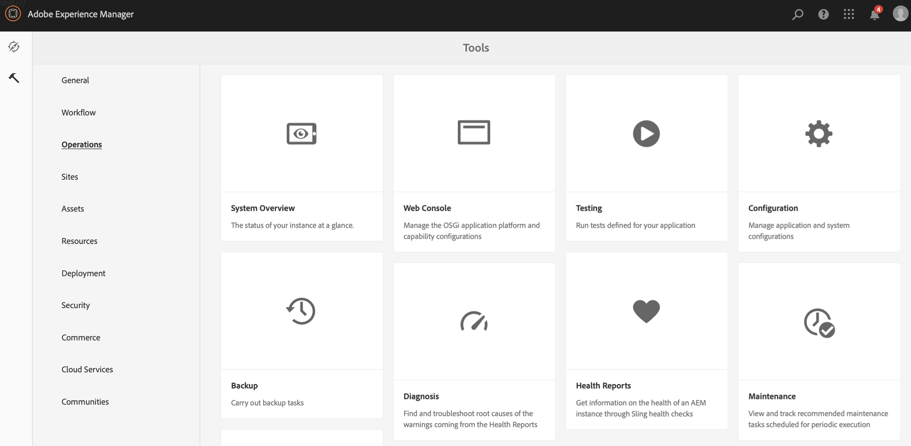

# Transición de ContentSync a SmartSync {#transitioning-from-contentsync-to-smartsync}

Esta sección proporciona información general sobre la función SmartSync y cómo minimiza la carga/almacenamiento del servidor y el tráfico de red para reducir los costes.

## Información general {#overview}

SmartSync es el último mecanismo utilizado por AEM Screens. Sirve como reemplazo del método actual utilizado para almacenar en caché los canales sin conexión y entregarlos al reproductor.

Se ejecuta tanto en el lado del servidor como en el lado del cliente.

**En el servidor**

* El contenido de los canales, incluidos los recursos, se almacena en caché en *`/var/contentsync`*.
* La caché se expone a los reproductores mediante un manifiesto que describe el contenido disponible para una visualización.

**En el lado del cliente**

* El reproductor actualiza su contenido en función del manifiesto generado anteriormente.

### Ventajas de usar SmartSync {#benefits-of-using-smartsync}

La función SmartSync proporciona varios beneficios a su proyecto de AEM Screens, como los siguientes:

* Reducción drástica del tráfico de red y de los requisitos de almacenamiento del lado del servidor.
* El reproductor descarga recursos de forma inteligente solo si el recurso falta o ha cambiado.
* Optimizaciones de almacenamiento del lado del servidor y del lado del cliente.

>[!NOTE]
>
>Adobe recomienda utilizar SmartSync para proyectos de AEM Screens.

## Migración de ContentSync a SmartSync {#migrating-from-contentsync-to-smartsync}

>[!NOTE]
>
>Si ya ha instalado el paquete de funciones 5 de AEM 6.3 y el paquete de funciones 3 de AEM 6.4, puede habilitar SmartSync para los recursos a fin de mejorar el uso del espacio en disco. Para habilitar SmartSync, siga la sección siguiente para pasar de ContentSync a SmartSync, habilitando así SmartSync.
>
>SmartSync está disponible para Screens Player con servidores compatibles AEM 6.4.3 FP3.
>
>Consulte [Descargas del reproductor AEM Screens](https://download.macromedia.com/screens/) para descargar el reproductor más reciente. En la tabla siguiente se describe la versión mínima del reproductor necesaria para cada plataforma:

| **Plataforma** | **Versión Mínima Del Reproductor Admitida** |
|---|---|
| Android™ | 3.3.72 |
| SO CHROME | 1.0.136 |
| Windows | 1.0.136 |

Siga los pasos a continuación para pasar de ContentSync a SmartSync:

1. La migración de ContentSync a SmartSync requiere borrar la caché de ContentSync antes de activar SmartSync.

   Vaya a la consola de ContentSync desde su instancia mediante el vínculo ***https://localhost:4502/libs/cq/contentsync/content/console.html*** y haga clic en **Borrar caché**, como se muestra en la figura siguiente:

   

   >[!CAUTION]
   >
   >Se debe borrar toda la caché de contenido antes de utilizar SmartSync por primera vez.

1. Vaya a la **configuración de la consola web de Adobe Experience Manager** mediante AEM instance > hammer icon > **Operaciones** > **Consola web**.

   

1. **Se abre la configuración de la consola web de Adobe Experience Manager**. Busque *offlinecontentservice*.

   Para buscar la propiedad **Screens Offline Content Service**, presione **Comando+F** para **Mac** y **Control+F** para **Windows**.

   

1. Haga clic en **Guardar** para habilitar la propiedad de **Screens Offline Content Services** y, por lo tanto, use SmartSync para AEM Screens.
1. Cuando haya habilitado SmartSync, vaya al proyecto y haga clic en **Actualizar contenido sin conexión** *(de la barra de acciones),*, como se muestra en la figura siguiente.

   
