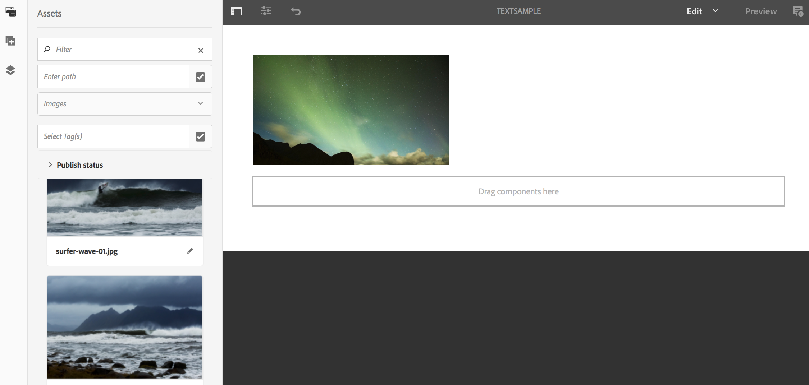

# Superposición de texto {#text-overlay}

Esta sección trata los siguientes temas:

* **Información general**
* **Uso de superposición de texto**
* **Explicación de las propiedades de superposición de texto**
* **Uso de valores de ContextHub en la superposición de texto**

>[!CAUTION]
>
>El **Superposición de texto** AEM AEM Esta función solo está disponible si ha instalado el paquete de funciones 5 o 3 de la versión 6.3 del paquete de funciones 3 del paquete de funciones de la versión 6.3 del paquete de funciones de la versión 5 o la versión 3 del paquete de funciones de la versión 6.4 de la versión.

## Información general {#overview}

La superposición de texto es una función disponible en AEM Screens que le permite crear una experiencia atractiva en un canal de secuencias al proporcionar un título o una descripción superpuestos sobre una imagen.

Para aprender a crear su propio componente personalizado, consulte **Ampliación de un componente de AEM Screens**.

Esta sección solo muestra cómo utilizar y aplicar el componente de póster en un proyecto de AEM Screens y utilizarlo como superposición de texto en uno de los canales de la secuencia.

## Uso de superposición de texto {#using-text-overlay}

En la siguiente sección se describe el uso de la superposición de texto en un proyecto de AEM Screens.

**Requisitos previos**

Antes de implementar esta funcionalidad, asegúrese de haber configurado un proyecto como requisito previo para comenzar a implementar la superposición de texto. Por ejemplo,

* Cree un proyecto de AEM Screens (en este ejemplo, **TextOverlayDemo**)

* Cree un canal de secuencia titulado como **TextSample** bajo **Canales** carpeta

* Añada contenido a su **TextSample** Canal

La siguiente imagen muestra el **TextOverlayDemo** proyecto con **TextSample** entrada de canal **Canales** carpeta.

Siga los pasos a continuación para utilizar la superposición de texto en un canal de AEM Screens:

1. Vaya a **TextOverlayDemo** > **Canales** > **TextSample** y haga clic en **Editar** de la barra de acciones.

   

1. Seleccione la imagen y haga clic en **Configurar** (icono de llave inglesa) para abrir el cuadro de diálogo propiedades.

   

1. Seleccione el **Superposición de texto** de la barra de navegación del cuadro de diálogo, como se muestra en la figura siguiente.

   

### Explicación de las propiedades de superposición de texto {#understanding-text-overlay-properties}

Con las propiedades de Superposición de texto, puede agregar texto a cualquiera de los componentes del proyecto de Pantallas. En la siguiente sección se ofrece una descripción general de las propiedades disponibles en Superposición de texto:

Puede agregar un texto al cuadro de texto y agregar énfasis tipográfico como negrita, cursiva y subrayado.

**Variante de color** Esta opción permite que el texto sea Oscuro (texto en color negro) o Claro (texto en color blanco).

**Tamaño y posicionamiento** Esta opción permite al usuario alinear el texto horizontal o verticalmente, o bien utilizar herramientas específicas para alinear el texto.

>[!NOTE]
>
>Para utilizar correctamente herramientas específicas, asegúrese de identificar la posición correcta en píxeles con (px) como sufijo, por ejemplo, 200 px. El resultado de esta expresión es de 200 píxeles desde el punto de inicio.

## Uso de valores de ContextHub en la superposición de texto {#using-text-overlay-context-hub}

En la siguiente sección se describe el uso de valores de un almacén de datos, por ejemplo, hojas de Google en el componente de superposición de texto.

**Requisitos previos**

Configure las opciones de ContextHub para el proyecto de AEM Screens.

Para obtener información sobre cómo configurar y administrar cambios en recursos impulsados por datos mediante un almacén de datos, consulte [Configuración de ContextHub en AEM Screens](https://experienceleague.adobe.com/en/docs/experience-manager-screens/user-guide/developing/configuring-context-hub).

Después de configurar las configuraciones necesarias para el proyecto, siga los pasos a continuación para utilizar los valores de las Hojas de cálculo de Google:

1. Vaya a **TextOverlayDemo** > **Canales** > **TextSample** y seleccione **Propiedades** de la barra de acciones.

1. Seleccione el **Personalización** para poder configurar las configuraciones de ContextHub.

   1. Seleccione el **Ruta de ContextHub** as **libs** > **configuración** > **cloudsettings** > **predeterminado** > **Configuraciones de ContextHub** y seleccione **Seleccionar**.

   1. Seleccione el **Ruta de segmentos** as **conf** > **pantallas** > **configuración** > **wcm** > **segmentos** y seleccione **Seleccionar**.

   1. Seleccione **Guardar y cerrar**.

      >[!NOTE]
      >
      >Utilice ContextHub y la ruta de segmentos, donde guardó inicialmente las configuraciones y segmentos de Context Hub.

      

1. Vaya a **TextOverlayDemo** > **Canales** > **TextSample** y haga clic en **Editar** de la barra de acciones.

   

1. Añada un componente de superposición de imagen y texto a la imagen como se describe en [Uso de superposición de texto](/help/user-guide/text-overlay.md#using-text-overlay) de esta página.

1. Seleccionar en **Configurar** (icono de la llave inglesa) para abrir **Imagen** Cuadro de diálogo.

   

1. Vaya a **ContextHub** de la pestaña **Imagen** Cuadro de diálogo. Seleccione **Añadir**.

   >[!NOTE]
   >Si no ha definido la configuración de ContextHub, esta opción está desactivada para el proyecto.

1. Entrar **Valor** en el **Marcador** field. Seleccione la fila en la que desea obtener el valor de la hoja de Google **Variable de ContextHub**. En este caso, el valor se recupera de la fila 2 y la columna 1 de las hojas de Google. Ahora, introduzca la **Valor predeterminado** as **20**, como se muestra en la figura siguiente. Cuando haya terminado, haga clic en la marca de verificación.

   

   >[!NOTE]
   >Para su referencia, la siguiente imagen muestra el valor recuperado de las hojas de Google:

   

1. Vaya de nuevo a **Superposición de texto** del cuadro de diálogo Imagen y agregue el texto *Temperatura actual {Value}*, como se muestra en la figura siguiente.

   

1. Seleccionar **Previsualizar**.

   
