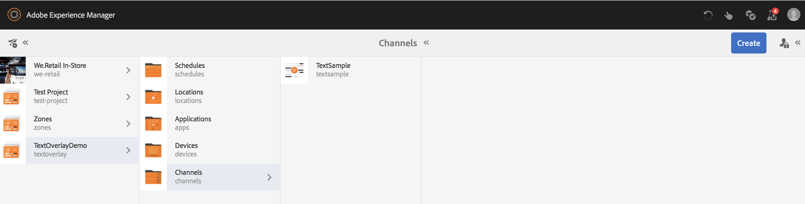

# Superposición de texto {#text-overlay}

Esta sección abarca los siguientes temas:

* **Información general**
* **Uso de la superposición de texto**
* **Explicación de las propiedades de superposición de texto**
* **Uso de valores de ContextHub en superposición de texto**

>[!CAUTION]
>
>La función **Texto superpuesto** solo está disponible si ha instalado AEM 6.3 Feature Pack 5 o AEM 6.4 Feature Pack 3.

## Información general {#overview}

La superposición de texto es una función disponible en AEM Screens que le permite crear una experiencia atractiva en un Canal de secuencia proporcionando un título o una descripción superpuestos sobre una imagen.

Para obtener información sobre cómo crear su propio componente personalizado, consulte **Ampliación de un componente** de pantallas de AEM.

En esta sección solo se muestra cómo utilizar y aprovechar el componente de póster en un proyecto de AEM Screens y utilizarlo como superposición de texto en uno de sus canales de secuencia.

## Uso de la superposición de texto {#using-text-overlay}

En la sección siguiente se describe el uso de la superposición de texto en un proyecto de AEM Screens.

**Requisitos previos**

Antes de inicio de implementar esta funcionalidad, asegúrese de haber configurado un proyecto como un requisito previo para la implementación de inicio de superposiciones de texto. Por ejemplo,

* Creación de un proyecto de AEM Screens (en este ejemplo, **TextOverlayDemo**)

* Creación de un canal de secuencia titulado como **TextSample** en la carpeta **Canales**

* Añadir contenido en el Canal **TextSample**

La siguiente imagen muestra el proyecto **TextOverlayDemo** con el canal **TextSample** en la carpeta **Canales** .

Siga los pasos a continuación para utilizar la superposición de texto en un canal de AEM Screens:

1. Vaya a **TextOverlayDemo** —> **Canales** —> **TextSample** y haga clic en **Editar** en la barra de acciones para abrir el editor.

   

1. Seleccione la imagen y haga clic en **Configurar** (icono de llave inglesa) para abrir el cuadro de diálogo de propiedades.

   

1. Seleccione la opción **Superposición** de texto en la barra de navegación del cuadro de diálogo, como se muestra en la figura siguiente.

   

### Explicación de las propiedades de superposición de texto {#understanding-text-overlay-properties}

Mediante las propiedades de superposición de texto, puede añadir texto a cualquiera de los componentes del proyecto Pantallas. La sección siguiente proporciona información general sobre las propiedades disponibles en la superposición de texto:

Puede agregar texto al cuadro de texto y agregar énfasis tipográfico, como negrita, cursiva, subrayado, etc.

**Variante** de color Esta opción permite que el texto sea Oscuro (texto en color negro) o Claro (texto en color blanco).

**Cambio de tamaño y posición** Esta opción permite al usuario alinear el texto horizontal o verticalmente o, además, utilizar herramientas específicas para la alineación del texto.

>[!NOTE]
>
>Para utilizar correctamente las herramientas específicas, asegúrese de identificar la posición correcta en píxeles utilizando (px) como sufijo, por ejemplo 200 px. El resultado de esta expresión será de 200 píxeles desde el punto de inicio.

## Uso de valores de ContextHub en superposición de texto {#using-text-overlay-context-hub}

En la sección siguiente se describe el uso de los valores de un almacén de datos, por ejemplo, hojas de Google en el componente de superposición de texto.

**Requisitos previos**

Debe configurar las configuraciones de ContextHub para el proyecto de AEM Screens.

Para obtener información sobre cómo configurar y administrar los cambios de recursos basados en datos mediante un almacén de datos, consulte [Configuración de ContextHub en pantallas](https://docs.adobe.com/content/help/en/experience-manager-screens/user-guide/developing/configuring-context-hub.html)AEM.

Una vez que haya configurado las configuraciones necesarias para su proyecto, siga los pasos a continuación para utilizar los valores de las hojas de Google:

1. Vaya a **TextOverlayDemo** —> **Canales** —> **TextSample** y haga clic en **Propiedades** en la barra de acciones.

1. Seleccione la ficha **Personalización** para configurar las configuraciones de ContextHub.

   1. Seleccione la Ruta **de** ContextHub como **bibliotecas** > **configuración** > **configuración** de nube > **predeterminada** **** ****> Configuraciones de ContextHub y haga clic enSeleccionar.

   1. Seleccione la Ruta **de** segmentos como **conf** > **pantallas** > **ajustes** > **wcm** **** ****>segmentosy haga clic en Seleccionar.

   1. Haga clic en **Guardar y cerrar**.

      >[!NOTE]
      >
      >Utilice ContextHub y la ruta de segmentos, donde inicialmente guardó las configuraciones y los segmentos del concentrador de contexto.

      

1. Vaya a **TextOverlayDemo** —> **Canales** —> **TextSample** y haga clic en **Editar** en la barra de acciones para abrir el editor.

   

1. Añada una imagen y un componente de superposición de texto en la imagen como se describe en la sección [Uso de superposición](/help/user-guide/text-overlay.md#using-text-overlay) de texto de esta página.

1. Haga clic en **Configurar** (icono de llave inglesa) para abrir el cuadro de diálogo **Imagen** .

   

1. Vaya a la ficha **ContextHub** desde el cuadro de diálogo **Imagen** . Haga clic en **Agregar**.

   >[!NOTE]
   >Si no ha configurado las configuraciones de ContextHub, esta opción se desactivará para su proyecto.

1. Introduzca **Valor** en el campo **Marcador** de posición, seleccione la fila que desea obtener del valor de la hoja de Google en la variable **** ContextHub (en este caso, el valor se recupera de la fila 2 y la columna 1 de las hojas de Google) e introduzca el Valor **** Predeterminado como **20**, como se muestra en la figura siguiente. Una vez que haya terminado, haga clic en la marca de verificación.

   

   >[!NOTE]
   >Para su referencia, la siguiente imagen muestra el valor que se recupera de las hojas de Google:

   

1. Vuelva a la ficha **Superposición** de texto del cuadro de diálogo Imagen y agregue el texto Temperatura *actual {Valor}*, como se muestra en la figura siguiente.

   

1. Haga clic en **Previsualización** para vista del resultado deseado.

   

