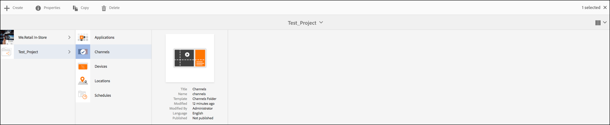

# Configuración y solución de problemas de reproducción de vídeo {#video-playback-configuration-and-troubleshooting}

Al cargar un vídeo en DAM y agregarlo a su canal, es posible que se encuentren problemas por los que el vídeo podría no reproducirse en el reproductor Screens.

Las secciones siguientes describen cómo depurar y solucionar problemas de reproducción de vídeo en el canal.

## Representaciones DAM {#dam-renditions}

Una vez cargado el vídeo en el canal, AEM debe empezar a crear algunas representaciones para él. Puede ver los vídeos en Assets.

Para ver el vídeo:

1. Vaya al vídeo, por ejemplo `http://localhost:4502/assets.html/content/dam/we-retail/en/videos`.
1. Haga clic en el vídeo y expanda el menú superior izquierdo y haga clic en **Representaciones**.

Debe haber diferentes representaciones (un MP4 o M4V).

Si no hay ninguna representación, asegúrese de que tiene instalado ffmpeg en el sistema operativo en el que AEM se está ejecutando.

>[!CAUTION]
>
>Si no hay ninguna representación, asegúrese de que tiene instalado ffmpeg en el sistema operativo en el que AEM se está ejecutando.
>
>Haga clic [aquí](https://www.ffmpeg.org/download.html) para instalar ffmpeg.

## Recursos de vídeo {#video-assets}

Si no ve un atributo de origen en vídeo, puede ser que el vídeo no se transcodificó. Si el vídeo está codificado correctamente, aparecerá en el panel, como se muestra en la figura siguiente.

Compruebe que ffmpeg esté instalado y los perfiles de vídeo.

### Comprobación del perfil de vídeo {#checking-video-profile}

1. Vaya al **Perfil de vídeo**, es decir, `http://localhost:4502/etc/dam/video.html` y haga clic en **Cargar vídeo de prueba**.

   

1. Cargue un vídeo de prueba y haga clic en **Ok** para comenzar la transcodificación.

   Si la transcodificación falla, expanda la salida ffmpeg para comprender cualquier error en la salida de la consola de ffmpeg.

   

   Además, si el vídeo transcodifica correctamente, puede descargar el archivo transcodificado.

   

   >[!NOTE]
   >
   >Asegúrese de dar tiempo suficiente para que el vídeo se transcodifique (debería mostrar la etiqueta nueva en lugar de procesar) antes de agregarla a cualquier canal.

### Comprobación de perfil con un componente de vídeo {#checking-profile-with-a-video-component}

Compruebe la lista de perfiles del diseño de página si el componente de vídeo no está configurado correctamente.

1. Vaya al canal y seleccione el modo **Design** .

   

1. Seleccione el vídeo y abra el cuadro de diálogo **Edit**. Abra la pestaña **Profiles**.

   >[!NOTE]
   >Seleccione diferentes perfiles (debe haber al menos un perfil H.264 de alta calidad).

### Comprobación del vídeo en el reproductor web {#checking-the-video-in-the-web-player}

Utilice el **Reproductor web** `http://localhost:4502/content/mobileapps/cq-screens-player/firmware.html/content/screens/we-retail/locations/demo/flagship/single/device0` para validar la reproducción en los navegadores (Chrome y Safari). Chrome se utiliza en dispositivos Android mientras que Safari es el explorador OSX e iOS.

Si el vídeo no se ejecuta en Safari, no se ejecutará en los reproductores OSX e iOS. Este es probablemente un problema de codificación y el vídeo debe volver a codificarse.

Siga estos pasos para utilizar un flujo de trabajo DAM para crear representaciones FullHD:

1. Vaya al *administrador del modelo de flujo de trabajo*, que es `http://localhost:4502/libs/cq/workflow/admin/console/content/models.html/etc/workflow/models`.
1. Seleccione el modelo **Screens Update Asset**.
1. haga clic en **Iniciar flujo de trabajo** en la barra de acciones para abrir el cuadro de diálogo **Ejecutar flujo de trabajo**.

1. Seleccione el recurso de vídeo en **Payload**.
1. Haga clic en **Ejecutar**.

>[!NOTE]
>
>Espere un poco para crear las representaciones, pero después de unos segundos/minutos (depende del tamaño del vídeo), vuelva a cargar el reproductor web en Safari.

#### Resolución de problemas del indicador de directiva de reproducción automática {#troubleshooting-autoplay-policy-flag}

En caso de que el reproductor de AEM Screens recoja el vídeo pero no se muestre, deberá solucionar los problemas del indicador de la directiva de reproducción automática.

Siga los pasos a continuación para solucionar el problema del indicador de la política de reproducción automática de google:

1. Vaya a ***chrome://flags/#autoplay-policy***
1. Cambiar **Política de reproducción automática** de **Predeterminada** a **no se requiere ningún gesto del usuario**

1. Vuelva a iniciar el explorador web y actualice el reproductor

>[!NOTE]
>
>Para obtener más información sobre las prácticas recomendadas para mejorar las experiencias de los usuarios con las nuevas políticas de reproducción automática en Chrome, consulte la documentación de *Cambios en las políticas de reproducción automática*, es decir, `https://developers.google.com/web/updates/2017/09/autoplay-policy-changes#webaudio`.

### Sincronización de vídeo entre varios reproductores {#syncing-video-across-multiple-players}

Para reproducir vídeos sincrónicamente en varios dispositivos, debe utilizar la estrategia absoluta para la secuencia de la que forma parte el vídeo.

#### Requisitos {#requirements}

* reproductores idénticos de 2+
* hardware similar idealmente
* topología de red idéntica (los reproductores están conectados a un servidor NTP que alinea sus relojes internos del sistema)

#### Configuración de la estrategia absoluta {#setting-up-the-absolute-strategy}

La estrategia absoluta:

* calcula una hora de anclaje (medianoche del día actual)
* calcula la duración de la secuencia (suma de la duración de todo su elemento)
* en cualquier momento, calcula qué elemento debe reproducirse en ese momento y el siguiente resolviendo la secuencia _remain_time = (current_time - anchor_time) % sequence_duration.

Siga los pasos a continuación para configurar una estrategia absoluta:

1. Vaya al autor del canal y seleccione el componente de secuencia como se muestra en la figura siguiente.
1. Abra el cuadro de diálogo de configuración.
1. Edite la **Estrategia** y añada absoluta.

   

   >[!NOTE]
   >El sistema operativo de los jugadores debe tener el mismo reloj.

**Alineación de bloques en OS** XFubique los pasos siguientes para alinear los relojes en OSX:

1. Abra las preferencias **Fecha y hora** en cada cuadro OSX
1. Marque **Establecer fecha y hora automáticamente**
1. Pegue el valor 0.pool.ntp.org, 1.pool.ntp.org, 2.pool.ntp.org, 3.pool.ntp.org, time.apple.com en el menú desplegable o simplemente ejecute *sudo ntpdate -u -v 0.pool.ntp.org*
1. Iniciar los más de 2 reproductores

Puede tardar algún tiempo antes de que los reproductores inicien una nueva secuencia alineada.

