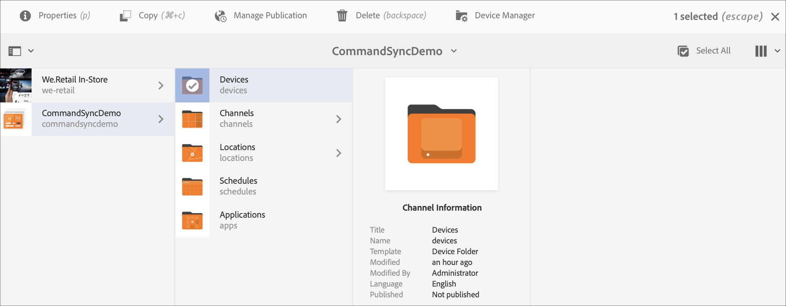

# Sincronización de comandos {#command-sync}

En la página siguiente se describe cómo utilizar la sincronización de comandos. La sincronización de comandos permite la reproducción sincronizada entre distintos reproductores. Los reproductores pueden reproducir contenido diferente, pero cada recurso debe tener la misma duración.

>[!IMPORTANT]
>Esta función no admite secuencias incrustadas, secuencias incrustadas dinámicas, canales de aplicación o transiciones.

## Información general {#overview}

Las soluciones de señalización digital necesitan admitir paredes de vídeo y reproducción sincronizada para admitir escenarios como las cuentas regresivas de Año Nuevo o los vídeos de gran tamaño divididos para reproducirse en varias pantallas, y aquí es donde entra en juego la sincronización de comandos.

Para utilizar la sincronización de comandos, un reproductor actúa como *maestro* y envía el comando, y todos los demás reproductores actúan como *clientes* y se reproducen cuando reciben el comando.

El *maestro* envía un comando a todos los clientes registrados cuando está a punto de iniciar la reproducción de un elemento. La carga útil de esto puede ser el índice del elemento que se va a reproducir y/o el HTML externo del elemento que se va a reproducir.

## Implementación de sincronización de comandos {#using-command-sync}

En la sección siguiente se describe cómo puede utilizar la sincronización de comandos en un proyecto de AEM Screens.

>[!NOTE]
>Para la reproducción sincronizada, es necesario que todos los dispositivos de hardware tengan las mismas especificaciones de hardware y, preferiblemente, el mismo sistema operativo. No se recomienda la sincronización entre hardware y sistemas operativos diferentes.

### Configuración del proyecto {#setting-up}

Antes de utilizar la función de sincronización de comandos, asegúrese de que tiene un proyecto y un canal con contenido configurado para el proyecto.

1. En el siguiente ejemplo se muestra un proyecto de demostración denominado **CommandSyncDemo** y un canal de secuencia **ChannelLobby**.

   

   >[!NOTE]
   >
   >Para obtener información sobre cómo crear un canal o agregar contenido a un canal, consulte [Creación y administración de canales](/help/user-guide/managing-channels.md)

   El canal contiene el siguiente contenido, como se muestra en la figura a continuación.

   

1. Cree una pantalla en la carpeta **Ubicaciones** , como se muestra en la figura siguiente.
   

1. Asigne el canal **ChannelLobby** a su **pantalla de vestíbulo**.
   

   >[!NOTE]
   >
   >Para obtener información sobre cómo asignar un canal a una pantalla, consulte [Creación y administración de pantallas](/help/user-guide/managing-displays.md).

1. Vaya a la carpeta **Dispositivos** y haga clic en Administrador **de dispositivos** en la barra de acciones para registrar los dispositivos.

   

   >[!NOTE]
   >
   >Para obtener información sobre cómo asignar un canal a una pantalla, consulte [Creación y administración de pantallas](/help/user-guide/managing-displays.md)

1. Para fines de demostración, este ejemplo muestra un dispositivo cromado y un reproductor de Windows como dos dispositivos independientes. Ambos dispositivos apuntan a la misma pantalla.
   

### Actualización de la configuración de canal

1. Vaya a **ChannelLobby** y haga clic en **Editar** en la barra de acciones para actualizar la configuración del canal.

1. Seleccione todo el canal como se muestra en la figura siguiente.
   

1. Haga clic en el icono de la llave inglesa para abrir el cuadro de diálogo **Página** .
   

1. Escriba la palabra clave *sincronizada* en el campo **Estrategia** .

   

### Configuración de un patrón {#setting-up-master}

1. Vaya al tablero de visualización desde **CommandSyncDemo** —> **Ubicaciones** —> **Punto de encuentro** —> **Pantalla** del vestíbulo y haga clic en **Tablero** desde la barra de acciones.
Verá los dos dispositivos (cromado y reproductor de Windows) en el panel **DISPOSITIVOS** , como se muestra en la figura siguiente.
   

1. En el panel **DISPOSITIVOS** , seleccione el dispositivo que desea definir como maestro. En el siguiente ejemplo se muestra la configuración del dispositivo Chrome como maestro. Haga clic en **Establecer como dispositivo** maestro.

   

1. Introduzca la dirección IP en **Establecer como dispositivo** maestro y haga clic en **Guardar**.

   

>[!NOTE]
> Puede configurar varios dispositivos como principales.

### Sincronización con Master {#sync-up-master}

1. Una vez que haya configurado el dispositivo Chrome como maestro, puede sincronizar el otro dispositivo (en este caso, el reproductor de Windows) para sincronizarlo con el maestro.
Seleccione el otro dispositivo (en este caso, el reproductor de Windows) en el panel **DISPOSITIVOS** y haga clic en **Sincronizar con el dispositivo** maestro, como se muestra en la figura siguiente.

   

1. Seleccione el dispositivo en la lista y haga clic en **Guardar**.

   >[NOTA:]
   > El cuadro de diálogo **Sincronizar con dispositivo** maestro mostrará la lista de dispositivos maestros. Puede seleccionar una de sus preferencias.

1. Una vez que el dispositivo (reproductor de Windows) se sincroniza con el maestro (reproductor de Chrome), verá el dispositivo sincronizado en el panel **DISPOSITIVOS** .

   

### Dessincronización con el maestro {#desync-up-master}

Una vez que haya sincronizado un dispositivo o dispositivos con un maestro, puede anular la sincronización de la asignación desde ese dispositivo.

>[!NOTE]
>Si desincroniza un dispositivo maestro, también desvinculará todos los dispositivos cliente asociados a dicho dispositivo maestro.

Para quitar la sincronización del dispositivo maestro, siga los pasos a continuación:

1. Vaya al panel **DISPOSITIVOS** y seleccione el dispositivo.

1. Haga clic en **Dessincronizar los dispositivos** para anular la sincronización del cliente desde el dispositivo maestro.

   

1. Haga clic en **Confirmar** para anular la sincronización del dispositivo seleccionado del maestro.

   >[NOTA:]
   > Si selecciona el dispositivo maestro y utiliza la opción de desincronización, todos los dispositivos conectados al maestro se dessincronizarán en un solo paso.
