# Reconocimiento de voz en AEM Screens {#voice-recognition}

>[!IMPORTANT]
>Este contenido es válido para AEM on-premise/AMS (AEM 6.5LTS y AEM 6.5). Para el contenido de AEM as a Cloud Service Screens, consulte la [guía de AEM as a Cloud Service](https://experienceleague.adobe.com/es/docs/experience-manager-cloud-service/content/screens-as-cloud-service/overview/introduction).

>[!IMPORTANT]
>
>**Información importante sobre privacidad**
>
>Al utilizar la función de reconocimiento de voz, siga todas las directrices legales y éticas aplicables en su región. Estas directrices incluyen, entre otras cosas, el envío de un aviso visible a los usuarios finales de que el reproductor utiliza el reconocimiento de voz. Adobe no recibe, almacena ni procesa ninguna información relacionada con la voz. Los reproductores de AEM Screens utilizan la API de voz web estándar integrada en el motor de exploración. Entre bastidores, esta API envía una forma de onda de su discurso a los servidores de Google para convertirlo de voz en texto. El reproductor hace coincidir el texto con las palabras clave configuradas.
>
>Consulte [Documento técnico de privacidad de Google sobre la API de voz en la web](https://www.google.com/chrome/privacy/whitepaper.html#speech) para obtener más información.

La función de reconocimiento de voz permite cambiar el contenido en un canal de AEM Screens impulsado por la interacción de voz.

Un autor de contenido puede configurar una pantalla para que esté habilitada para voz. El propósito de esta función es permitir que los clientes utilicen la voz como un método para interactuar con sus pantallas. Algunos casos de uso similares incluyen encontrar recomendaciones de productos en tiendas, ordenar elementos de menú en comensales y restaurantes. Esta función aumenta la accesibilidad para los usuarios y puede mejorar en gran medida la experiencia del cliente.

>[!NOTE]
>El hardware del reproductor debe admitir entradas de voz, como un micrófono.

## Implementación del reconocimiento de voz {#implementing}

>[!IMPORTANT]
> La función de reconocimiento de voz solo está disponible en el sistema operativo Chrome y en los reproductores Windows.

Para implementar el reconocimiento de voz en su proyecto de AEM Screens, habilite el reconocimiento de voz para la pantalla y asocie cada canal con una etiqueta única para almacenar en déclencheur una transición de canal.

En la siguiente sección se describe cómo habilitar y utilizar la función de reconocimiento de voz en un proyecto de AEM Screens.

## Conmutador de canal de visualización de contenido en pantalla completa o en pantalla dividida {#sequence-channel}

Antes de usar una función de reconocimiento de voz, asegúrese de que tiene un proyecto y un canal con contenido configurado para su proyecto.

1. El siguiente ejemplo muestra un proyecto de demostración denominado **VoiceDemo** y tres canales de secuencia **Main**, **ColdDrinks** y **HotDrinks**, como se muestra en la figura siguiente.

   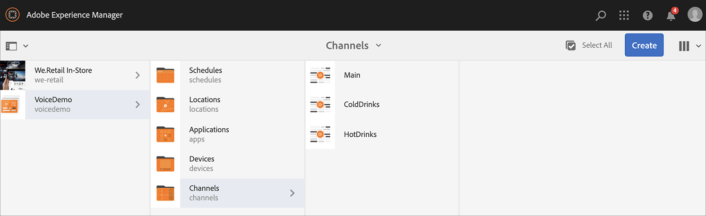

   >[!NOTE]
   >
   >Para obtener información sobre cómo crear un canal o agregar contenido a un canal, consulte [Creación y administración de canales](/help/user-guide/managing-channels.md)

   O bien,

   Puede crear tres canales de secuencia **Principal**, **Bebidas frías** y **Bebidas calientes**, y uno más de canal de Screens dividido de 1x2 **SplitScreen**, como se muestra en la figura siguiente.

   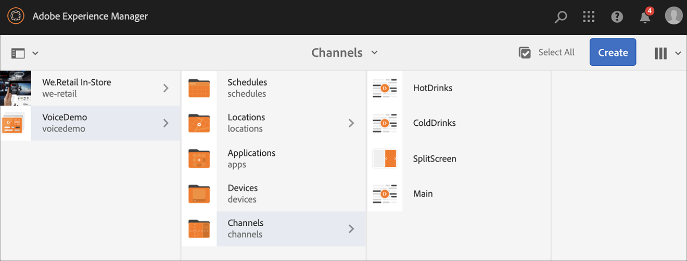

1. Vaya a cada uno de los canales y añada contenido. Por ejemplo, vaya a **VoiceDemo** > **Canales** > **Principal** y haga clic en el canal. Haga clic en **Editar** en la barra de acciones y, a continuación, agregue contenido (imágenes/vídeos) según sus necesidades. Del mismo modo, agregue contenido al canal **ColdDrinks** y al canal **HotDrinks**.

   Los canales ahora contienen recursos (imágenes), como se muestra en las figuras siguientes.

   **Principal**:

   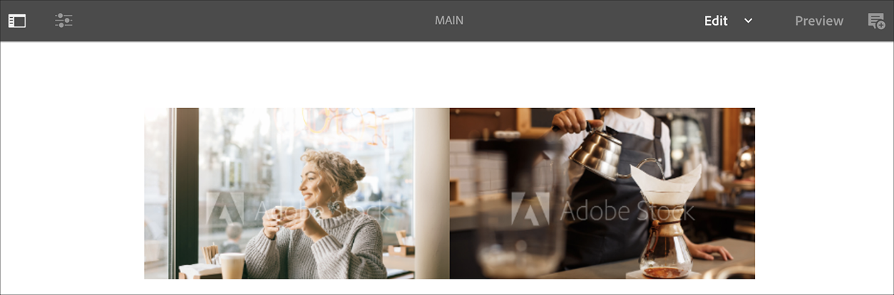

   **Refrescos**:

   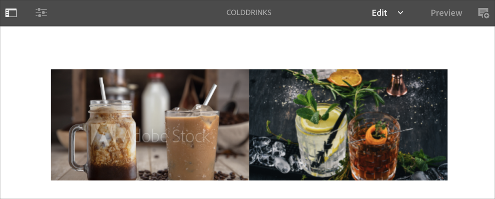

   **bebidas calientes**:

   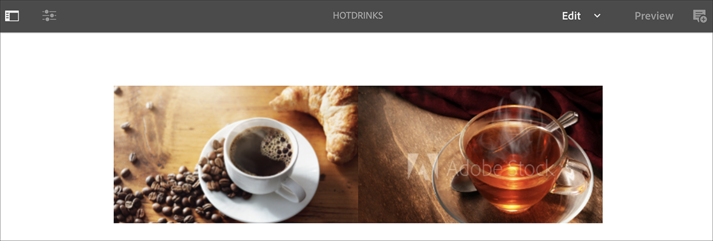

   Si agregó el canal Split Screens a su proyecto, vaya a **SplitScreen** y arrastre y suelte dos secuencias incrustadas. Agregue rutas al canal **ColdDrinks** y **HotDrinks** tal y como se muestra en la figura siguiente.   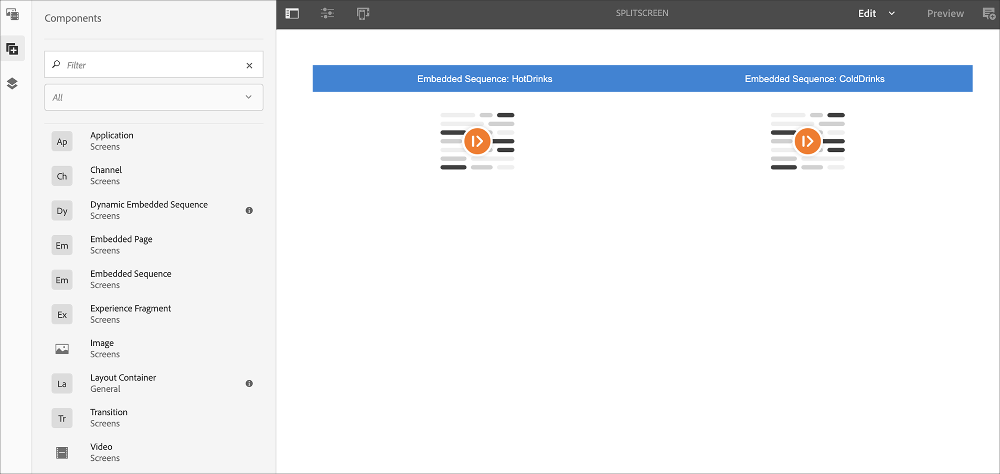

### Configuración de etiquetas para canales {#setting-tags}

Cuando haya añadido contenido a sus canales, vaya a cada uno de ellos y añada las etiquetas adecuadas que puedan reconocer la voz en el déclencheur.

Siga los pasos a continuación para añadir etiquetas a su canal:

1. Vaya a cada uno de los canales y añada contenido. Por ejemplo, vaya a **VoiceDemo** > **Canales** > **Principal** y haga clic en el canal.

1. Haga clic en **Propiedades** en la barra de acciones.

   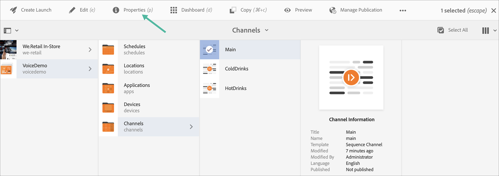

1. Vaya a la pestaña **Conceptos básicos** y, a continuación, haga clic en una etiqueta existente del campo **Etiquetas**, o bien cree una.

   Puede crear una etiqueta escribiendo un nombre nuevo para la etiqueta y pulsando la tecla `return`, como se muestra en la figura siguiente:

   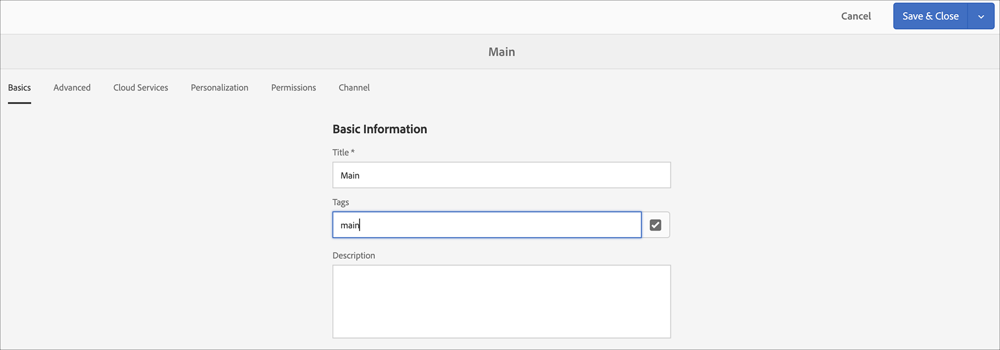

   O bien,

   También puede crear etiquetas a partir de la instancia de AEM de antemano para su proyecto y seleccionarlas. Después de seguir los pasos explicados en [Creación de etiquetas](#creating-tags), puede hacer clic en la etiqueta desde la ubicación y agregarla al canal, como se muestra en la figura siguiente:

   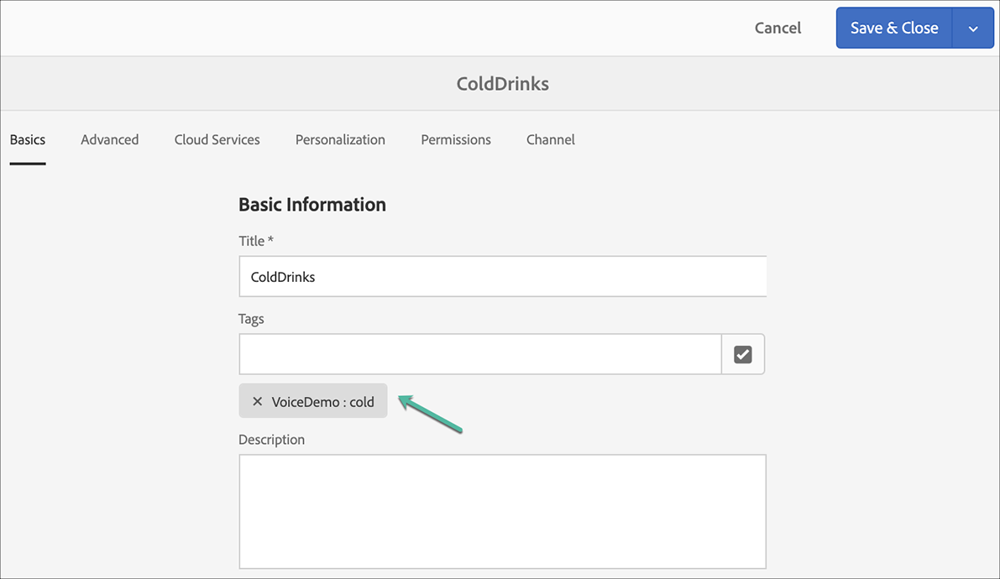

1. Del mismo modo, agregue una etiqueta con el título **hot** al canal **HotDrinks**.

1. Si usa un canal de Split Screens, agregue ambas etiquetas (**hot** y **GOLD**) a las propiedades de canal **SplitScreen**, como se muestra en la figura siguiente.

   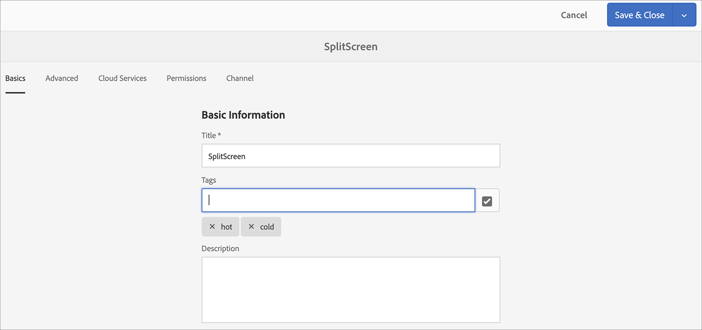

1. Haga clic en **Guardar y cerrar** cuando haya terminado.

### Creación de etiquetas {#creating-tags}

Siga los pasos a continuación para crear etiquetas:

1. Vaya a la instancia de AEM.

1. Haga clic en el icono de herramientas > **Etiquetado**.
   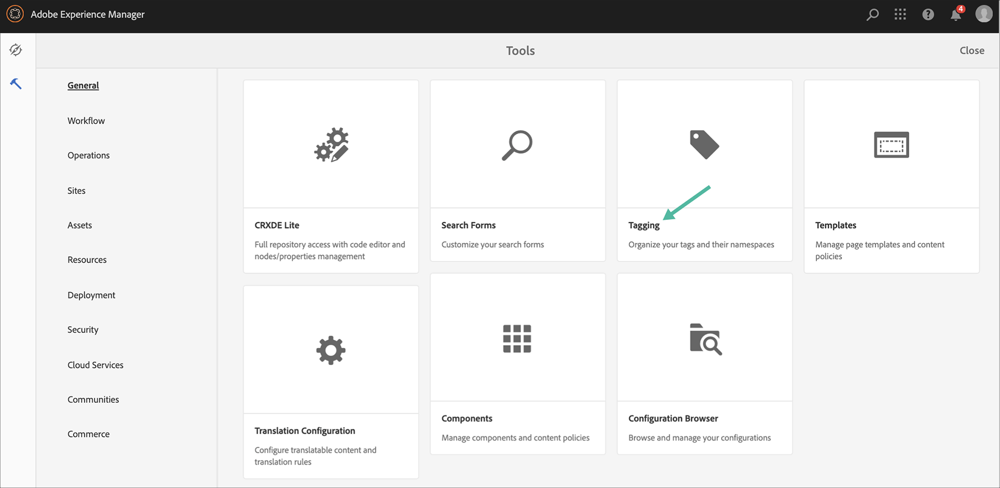

1. Haga clic en **Crear** > **Crear área de nombres**.
   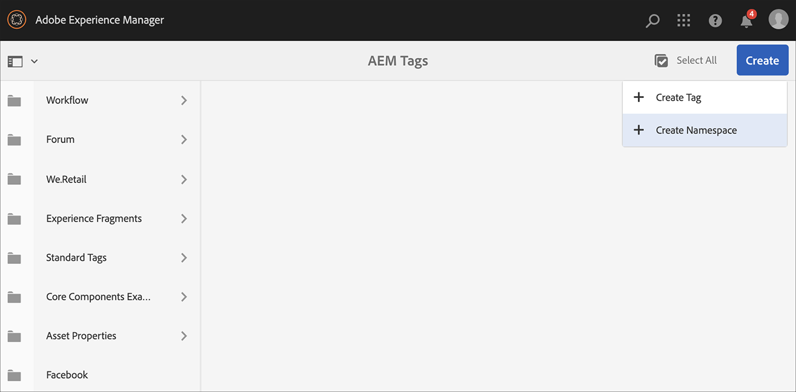

1. Escriba el nombre de su proyecto, por ejemplo, **VoiceDemo** y haga clic en **Crear**.

1. Haga clic en el proyecto **VoiceDemo** y luego haga clic en **Crear etiqueta** en la barra de acciones.
   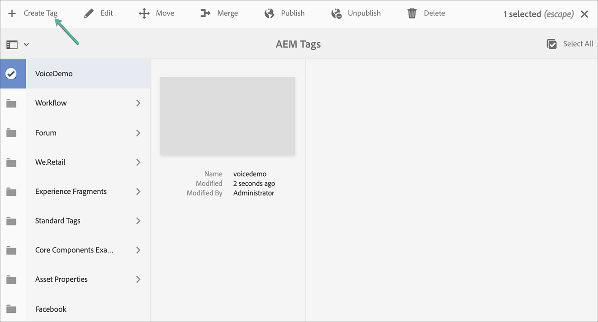

1. Escriba el nombre de su etiqueta y haga clic en **Enviar**.
   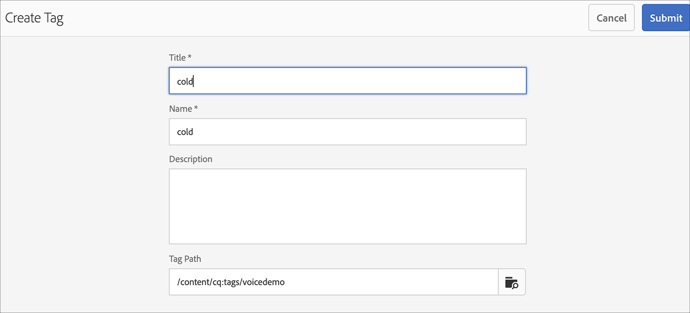

Ahora puede utilizar estas etiquetas en su proyecto de AEM Screens.

### Asignación de canales a una pantalla y activación del reconocimiento de voz {#channel-assignment}

1. Cree una pantalla en la carpeta **Ubicaciones**, como se muestra en la figura siguiente.

   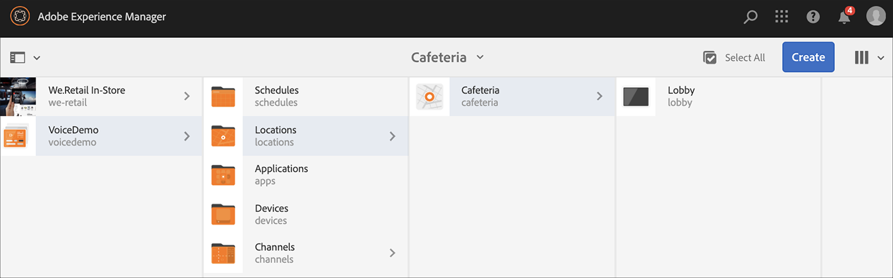

   >[!NOTE]
   >Para obtener información sobre cómo asignar un canal a una pantalla, consulte [Creación y administración de pantallas](/help/user-guide/managing-displays.md).

1. Asigne los canales **Main**, **ColdDrinks** y **HotDrinks** a su **pantalla del vestíbulo**. Además, si estás usando el canal **SplitScreen** para tu proyecto, asegúrate de asignarlo a la pantalla.

   >[!NOTE]
   >Si has creado un canal de pantalla dividida, asigna el canal **SplitScreen** a tu pantalla.

1. Establezca las siguientes propiedades en cada uno de los canales al asignar el canal.

   | **Nombre de canal** | **Prioridad** | **Eventos admitidos** |
   |---|---|---|
   | Principal | 2 | Carga inicial, pantalla inactiva, temporizador |
   | Bebidas | 1 | Interacción del usuario |
   | Bebidas frías | 1 | Interacción del usuario |
   | SplitScreen | 1 | Interacción del usuario |

   >[!NOTE]
   >
   >Para obtener información sobre cómo asignar un canal a una pantalla, consulte [Creación y administración de pantallas](/help/user-guide/managing-displays.md).

1. Una vez que haya asignado canales a una pantalla, vaya a **LobbyDisplay** y haga clic en la pantalla. Haga clic en **Propiedades** en la barra de acciones.

1. Vaya a la pestaña **Mostrar** y habilite la opción **Voz habilitada** en **Contenido**.

   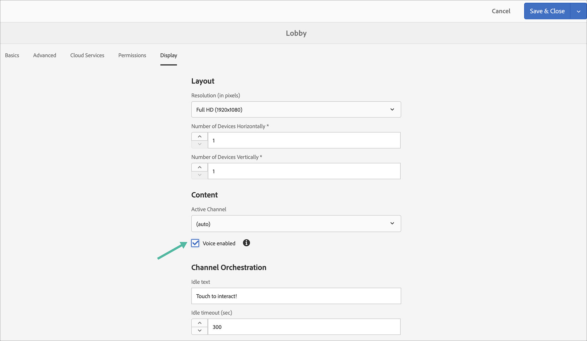

   >[!IMPORTANT]
   >Es obligatorio activar la función de reconocimiento de voz desde la pantalla.

### Visualización del contenido en el reproductor de Chrome {#viewing-content}

Cuando haya completado los pasos anteriores, puede registrar el dispositivo Chrome para ver el resultado.

>[!NOTE]
>Consulte [Registro de dispositivos](device-registration.md).

**Salida deseada para el canal de secuencia**

El canal **Main** está reproduciendo su contenido. Sin embargo, cuando usa palabras con la palabra clave **hot**, como *me gustaría tomar una bebida caliente*, el canal comienza a reproducir el contenido del canal **HotDrinks**.

Del mismo modo, si usa una palabra con una palabra clave **cool** como *Me gustaría tener algo frío*, el canal comenzará a reproducir el contenido del canal **ColdDrinks**.

**Salida deseada para el canal dividido de Screens**

El canal **Main** está reproduciendo su contenido. Sin embargo, cuando usas palabras con las palabras clave **hot** y **dry** juntas, como *me gustaría ver el menú de bebidas calientes y frías*, el canal reproduce el contenido del canal **SplitScreen**. Si dices *volver al menú principal*, vuelve al canal **Principal**.

