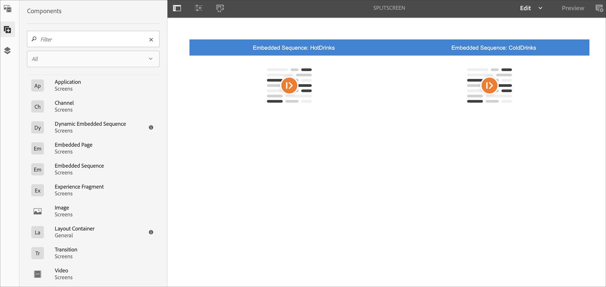

# Reconocimiento de voz en AEM Screens {#voice-recognition}

>[!IMPORTANT]
>
>**Información importante sobre la privacidad**
>
>Al utilizar la función de reconocimiento de voz, siga todas las directrices legales y éticas aplicables para su región (incluido, entre otras cosas, el aviso visible a los usuarios finales de que el reproductor está utilizando el Reconocimiento de voz). Adobe Inc. no recibe, almacena ni procesa ninguna información relacionada con la voz. Los reproductores de AEM Screens utilizan la API de voz web estándar integrada en el motor de navegación. Entre bastidores, esta API envía una forma de onda de su discurso a los servidores de Google para la conversión de voz a texto y este texto coincide con el reproductor en comparación con las palabras clave configuradas.
>
>Consulte el [Documento técnico de privacidad de Google sobre la API de voz web](https://www.google.com/chrome/privacy/whitepaper.html#speech) para obtener más información.

La función de reconocimiento de voz permite cambiar el contenido en un canal de AEM Screens impulsado por la interacción de voz.

Un autor de contenido puede configurar una pantalla para que tenga habilitada la voz. El propósito de esta función es permitir a los clientes utilizar la voz como método para interactuar con sus pantallas. Algunos casos de uso similares incluyen encontrar recomendaciones de productos en tiendas, pedidos de artículos de menú en restaurantes y restaurantes. Esta función aumenta la accesibilidad para los usuarios y puede mejorar en gran medida la experiencia del cliente.

>[!NOTE]
>El hardware del reproductor debe admitir la entrada de voz, como un micrófono.

## Implementación del reconocimiento de voz {#implementing}

>[!IMPORTANT]
> La función de reconocimiento de voz solo está disponible en reproductores Chrome OS y Windows.

Para implementar el reconocimiento de voz en el proyecto de AEM Screens, debe habilitar el reconocimiento de voz para la visualización y asociar cada canal con una etiqueta única para el déclencheur de una transición de canal.

En la siguiente sección se describe cómo habilitar y utilizar la función de reconocimiento de voz en un proyecto de AEM Screens.

## Visualización de contenido en pantalla completa o conmutador de canal en pantalla dividida {#sequence-channel}

Antes de utilizar la función de reconocimiento de voz, asegúrese de que tiene un proyecto y un canal con contenido configurado para el proyecto.

1. El siguiente ejemplo muestra un proyecto de demostración denominado **VoiceDemo** y tres canales de secuencia **Main**, **ColdDrinks** y **HotDrinks**, como se muestra en la figura siguiente.

   

   >[!NOTE]
   >
   >Para obtener información sobre cómo crear un canal o añadir contenido a un canal, consulte [Creación y administración de canales](/help/user-guide/managing-channels.md)

   O bien,

   Puede crear tres canales de secuencia **Main**, **ColdDrinks** y **HotDrinks**, y un canal adicional de 1x2 Split Screens **SplitScreen** como se muestra en la figura siguiente.

   

1. Vaya a cada canal y añada contenido. Por ejemplo, vaya a **VoiceDemo** —> **Channels** —> **Main** y seleccione el canal. Haga clic en **Editar** en la barra de acciones para abrir el editor y añadir contenido (imágenes/vídeos) según sus necesidades. Del mismo modo, agregue contenido tanto a **ColdDrinks** como al canal **HotDrinks**.

   Los canales ahora contienen recursos (imágenes), como se muestra en las figuras siguientes.

   **Principal**:

   

   **ColdDrinks**:

   

   **HotDrinks**:

   

   Si ha agregado el canal Split Screens al proyecto, vaya al canal **SplitScreen** y arrastre y suelte dos secuencias incrustadas y añada rutas al canal **ColdDrinks** y al canal **HotDrinks** como se muestra en la figura siguiente.
   

### Configuración de etiquetas para canales {#setting-tags}

Una vez que haya añadido contenido a los canales, debe navegar a cada uno de ellos y agregar las etiquetas adecuadas que puedan dar déclencheur al reconocimiento de voz.

Siga los pasos a continuación para agregar etiquetas al canal:

1. Vaya a cada canal y añada contenido. Por ejemplo, vaya a **VoiceDemo** —> **Channels** —> **Main** y seleccione el canal.

1. Haga clic en **Properties** en la barra de acciones.

   

1. Vaya a la pestaña **Basics** y seleccione una etiqueta existente en el campo **Tags** o cree una nueva.

   Para crear una etiqueta nueva, escriba un nombre nuevo para la etiqueta y pulse la tecla `return`, como se muestra en la figura siguiente:

   

   O bien,

   También puede crear etiquetas a partir de su instancia de AEM previamente para su proyecto y seleccionarlas. Una vez que siga los pasos descritos en [Creación de etiquetas](#creating-tags), puede seleccionar la etiqueta de la ubicación y añadirla al canal, como se muestra en la figura siguiente:

   

1. Del mismo modo, agregue la etiqueta titulada como **hot** al canal **HotDrinks**.

1. Si está utilizando un canal Split Screens, agregue ambas etiquetas (**hot** y **fría**) a las propiedades de canal **SplitScreen**, como se muestra en la figura siguiente.

   

1. Haga clic en **Guardar y cerrar** una vez que haya terminado.

### Creación de etiquetas {#creating-tags}

Siga los pasos a continuación para crear etiquetas:

1. Vaya a la instancia de AEM.

1. Haga clic en el icono de herramientas —> **Etiquetado**.
   

1. Haga clic en **Crear** —> **Crear área de nombres**.
   

1. Introduzca el nombre del proyecto, por ejemplo, **VoiceDemo** y haga clic en **Create**.

1. Seleccione el proyecto **VoiceDemo** y haga clic en **Crear etiqueta** en la barra de acciones.
   

1. Introduzca el nombre de la etiqueta y haga clic en **Submit**.
   

Ahora puede utilizar estas etiquetas en su proyecto de AEM Screens.

### Asignación de canales a una pantalla y activación del reconocimiento de voz {#channel-assignment}

1. Cree una visualización en la carpeta **Ubicaciones**, como se muestra en la figura siguiente.

   

   >[!NOTE]
   >Para obtener información sobre cómo asignar un canal a una pantalla, consulte [Creación y administración de visualizaciones](/help/user-guide/managing-displays.md).

1. Asigne los canales **Main**, **ColdDrinks** y **HotDrinks** a su **LobbyDisplay**. Además, si está utilizando el canal **SplitScreen** para su proyecto, asegúrese de asignarlo a la pantalla.

   >[!NOTE]
   >Si ha creado un canal de pantalla dividida, asigne el canal **SplitScreen** a la pantalla.

1. Establezca las siguientes propiedades en cada uno de los canales, mientras asigna el canal.

   | **Nombre del canal** | **Prioridad** | **Eventos admitidos** |
   |---|---|---|
   | Principal | 2 | Carga inicial, Pantalla inactiva, Temporizador |
   | HotDrinks | 1 | Interacción del usuario |
   | ColdDrinks | 3 | Interacción del usuario |
   | SplitScreen | 3 | Interacción del usuario |

   >[!NOTE]
   >
   >Para obtener información sobre cómo asignar un canal a una pantalla, consulte [Creación y administración de visualizaciones](/help/user-guide/managing-displays.md).

1. Una vez que haya asignado los canales a una visualización, vaya a **LobbyDisplay** y seleccione la visualización. Seleccione **Properties** en la barra de acciones.

1. Vaya a la pestaña **Display** y habilite la opción **Voice enabled** en **Content**.

   

   >[!IMPORTANT]
   >Es obligatorio habilitar la función de reconocimiento de voz desde la pantalla.

### Visualización del contenido en el reproductor Chrome {#viewing-content}

Una vez completados los pasos anteriores, puede registrar el dispositivo Chrome para ver la salida.

>[!NOTE]
>Consulte [Device Registration](device-registration.md) para obtener información sobre cómo registrar un dispositivo en un reproductor de AEM Screens.

**Salida deseada para el canal de secuencia**

El canal **Principal** está reproduciendo su contenido, pero cuando usa palabras con la palabra clave **hot** como *Me gustaría tomar una bebida caliente*, el canal comienza a reproducir el contenido del canal **HotDrinks**.

Del mismo modo, si usa palabra con una palabra clave **fría** como *Me gustaría tener algo frío*, el canal comienza a reproducir el contenido del canal **ColdDrinks**.

**Salida deseada para el canal Dividir Screens**

El canal **Principal** está reproduciendo su contenido, pero cuando usa palabras con las palabras clave **hot** y **fría** juntas, como *Me gustaría ver el menú para bebidas calientes y frías*, el canal comienza a reproducir el contenido del canal **SplitScreen**. Si vuelve a *volver al menú principal*, vuelve al canal principal.

