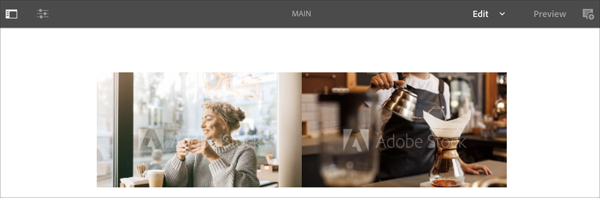

# Reconocimiento de voz en AEM Screens {#voice-recognition}

## Información general {#overview}

La función de reconocimiento de voz permite cambiar el contenido de un canal de AEM Screens impulsado por la interacción de voz.

Un autor de contenido puede configurar una pantalla para que esté habilitada para voz. El propósito de esta función es permitir que los clientes utilicen la voz como método para interactuar con sus pantallas. Algunos casos de uso similares incluyen la búsqueda de recomendaciones de productos en tiendas, pedidos de artículos de menú en restaurantes y restaurantes. Esta función aumenta la accesibilidad para los usuarios y puede mejorar considerablemente la experiencia del cliente.

>[!NOTE]
>El hardware del reproductor debe admitir la entrada de voz, como un micrófono.

>[!IMPORTANT]
> La función de reconocimiento de voz solo está disponible en reproductores de Chrome y Electron.

## Implementación del reconocimiento de voz {#implementing}

Para implementar el reconocimiento de voz en su proyecto de AEM Screens, debe habilitar el reconocimiento de voz para la visualización y asociar cada canal con una etiqueta única para activar una transición de canal.

En la sección siguiente se describe cómo activar y utilizar la función Reconocimiento de voz en un proyecto de AEM Screens.

### Configuración del proyecto {#setting-up}

Antes de utilizar la función de reconocimiento de voz, asegúrese de que tiene un proyecto y un canal con contenido configurado para el proyecto.

1. En el siguiente ejemplo se muestra un proyecto de demostración denominado **VoiceDemo** y tres canales de secuencia **Main**, **ColdDrinks** y **HotDrinks**, como se muestra en la figura siguiente.

   

   >[!NOTE]
   >
   >Para obtener información sobre cómo crear un canal o agregar contenido a un canal, consulte [Creación y administración de Canales](/help/user-guide/managing-channels.md)

1. Navegue hasta cada uno de los canales y agregue contenido. Por ejemplo, vaya a **VoiceDemo** —> **Canales** —> **Principal** y seleccione el canal. Haga clic en **Editar** en la barra de acciones para abrir el editor y agregar contenido (imágenes/vídeos) según sus necesidades. Del mismo modo, agregue contenido tanto a **ColdDrinks** como al canal **HotDrinks** .

   Los canales ahora contienen recursos (imágenes), como se muestra en las figuras siguientes.

   **Principal**:

   

   **ColdDrinks**:

   

   **HotDrinks**:

   

### Configuración de etiquetas para Canales {#setting-tags}

Una vez que haya agregado contenido a sus canales, debe desplazarse a cada uno de los canales y agregar las etiquetas apropiadas que activarían el reconocimiento de voz.

Siga los pasos a continuación para agregar etiquetas a su canal:

1. Navegue hasta cada uno de los canales y agregue contenido. Por ejemplo, vaya a **VoiceDemo** —> **Canales** —> **Principal** y seleccione el canal.

1. Click **Properties** from the action bar.

   

1. Vaya a la ficha **Conceptos básicos** y seleccione una etiqueta existente en el campo **Etiquetas** o cree una nueva.

   Puede crear una nueva etiqueta escribiendo un nuevo nombre para la etiqueta, como se muestra en la figura siguiente:

   

   O bien,

   Puede crear etiquetas a partir de la instancia de AEM de antemano para el proyecto y seleccionarlas también.

   Siga los pasos a continuación para crear etiquetas:

   1. Vaya a la instancia de AEM.
   1. Haga clic en las herramientas —> **Etiquetado**.
      

1. Haga clic en **Guardar y cerrar** una vez que haya terminado.

Del mismo modo, agregue la etiqueta titulada como **caliente** al canal **HotDrinks** y **frío** al canal **ColdDrinks** .

### Asignación de Canales a una visualización {#channel-assignment}

1. Cree una pantalla en la carpeta **Ubicaciones** , como se muestra en la figura siguiente.

   >[!NOTE]
   >
   >Para obtener información sobre cómo asignar un canal a una pantalla, consulte [Creación y administración de pantallas](/help/user-guide/managing-displays.md).

1. Asigne los canales **Principal**, **Refrescos** y **Bebidas** calientes **a su** pantalla de vestíbulo.

1. Defina las siguientes propiedades en cada uno de los canales.

   >[!NOTE]
   >
   >Para obtener información sobre cómo asignar un canal a una pantalla, consulte [Creación y administración de pantallas](/help/user-guide/managing-displays.md).

1. Una vez que haya asignado canales a una pantalla, navegue hasta la **pantalla del vestíbulo** y seleccione la pantalla. Seleccione **Propiedades** en la barra de acciones.

1. Vaya a la ficha **Mostrar** y active la opción **Voz habilitada** en **Contenido**.

   >[!NOTE]
   >Es obligatorio activar la función de reconocimiento de voz desde la pantalla.

## Visualización del contenido en Chrome Player {#viewing-content}

Una vez completados los pasos anteriores, puede registrar el dispositivo cromado y vista de la salida.

Complete los siguientes pasos:

1. Vaya a la carpeta **Dispositivos** y haga clic en Administrador **de dispositivos** en la barra de acciones para registrar los dispositivos.

